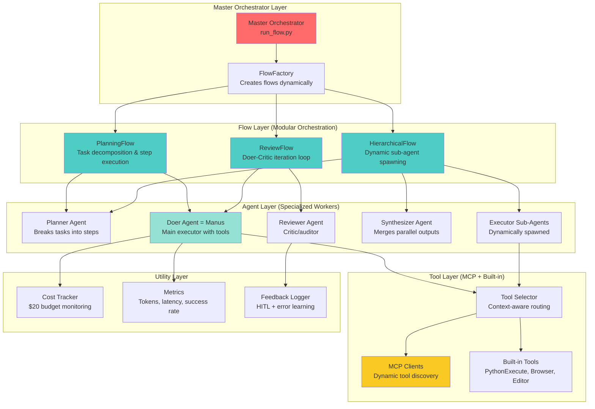

# OpenManus → Opus 4.5 Architecture Map

## System Overview: Modular, Hierarchical, Tool-Augmented

This architecture is **fully modular** with clear separation of concerns:

- **Agents** = Autonomous decision-makers (inherit from BaseAgent)
- **Flows** = Orchestration logic (inherit from BaseFlow)
- **Tools** = Action executors (MCP + built-in)
- **Utilities** = Supporting infrastructure (cost tracking, metrics, logging)

---

## High-Level Architecture Diagram



---

## Detailed Component Breakdown

### 1. Master Orchestrator (`run_flow.py`)

**Role**: Entry point that initializes agent dictionary and delegates to flows.

**Modular Design**:

- Accepts multiple agents as dictionary: `{"manus": Manus(), "reviewer": Reviewer(), ...}`
- Dynamically selects flow type via FlowFactory
- No hardcoded logic, all orchestration happens in flows

**Key Responsibilities**:

- Parse CLI arguments (`--high-effort`, `--prompt`)
- Initialize agent pool
- Hand off to FlowFactory

**Files**:

- [run_flow.py](file:///c:/Users/jacob/OneDrive/Desktop/OpenManus_Antigravity/openmanus/run_flow.py)

---

### 2. Flow Layer (Modular Orchestration)

Each flow is **independently testable** and **swappable**.

#### 2.1 PlanningFlow (`app/flow/planning.py`)

**Role**: Multi-stage reasoning with task decomposition.

**Workflow**:

1. Take user request → LLM creates plan with 5-10 steps
2. For each step:
   - Mark as IN_PROGRESS
   - Select appropriate executor agent
   - Execute step with tools
   - Verify completion
   - Mark as COMPLETED or retry

**Modularity**:

- Can run standalone or nested within HierarchicalFlow
- Pluggable executors (swappable agents)

**Files**:

- [app/flow/planning.py](file:///c:/Users/jacob/OneDrive/Desktop/OpenManus_Antigravity/openmanus/app/flow/planning.py)

#### 2.2 ReviewFlow (`app/flow/review.py`) [NEW]

**Role**: Self-correction loop (Doer-Critic pattern).

**Workflow**:

1. Doer agent produces output
2. Reviewer agent audits → grades PASS/FAIL + 3 specific issues
3. If FAIL: Feed feedback to Doer, iterate (max 3-5 times)
4. If PASS or max iterations: Return final output

**Modularity**:

- Wraps any agent pair (not just Manus + Reviewer)
- Configurable max iterations
- Optional HITL pause for user feedback

**Files**:

- [app/flow/review.py](file:///c:/Users/jacob/OneDrive/Desktop/OpenManus_Antigravity/openmanus/app/flow/review.py) (to be created)

#### 2.3 HierarchicalFlow (`app/flow/hierarchical.py`) [NEW]

**Role**: Orchestrator-worker pattern with dynamic sub-agent spawning.

**Workflow**:

1. Top-level Planner generates task graph (DAG)
2. For each branch in graph:
   - Spawn specialized Executor sub-agent (e.g., CodeExecutor, SearchAgent)
   - Run sub-agents in parallel (via `asyncio.gather()`)
3. Synthesizer agent merges outputs
4. Handle failures by respawning branches

**Modularity**:

- Task graph can be generated by any planner
- Executors are dynamically instantiated based on task type
- Synthesizer is swappable

**Files**:

- [app/flow/hierarchical.py](file:///c:/Users/jacob/OneDrive/Desktop/OpenManus_Antigravity/openmanus/app/flow/hierarchical.py) (to be created)

---

### 3. Agent Layer (Specialized Workers)

All agents inherit from **BaseAgent** ([app/agent/base.py](file:///c:/Users/jacob/OneDrive/Desktop/OpenManus_Antigravity/openmanus/app/agent/base.py)).

**Base Capabilities**:

- `run(prompt)`: Main execution loop
- `step()`: Single reasoning/action step (abstract, implemented by subclasses)
- `max_steps`: Configurable iteration limit (20 default, 30-50 for high-effort)
- `memory`: Message history
- `llm`: LLM instance (supports multi-LLM via config)

#### 3.1 Planner Agent (`app/agent/planner.py`) [NEW]

**Role**: Task decomposition specialist.

**System Prompt**: "Break this task into 5-10 actionable steps. Use Chain-of-Thought reasoning."

**Tools**: PlanningTool (already exists in OpenManus)

**Output**: Structured plan with steps, dependencies, estimated effort

**Files**:

- [app/agent/planner.py](file:///c:/Users/jacob/OneDrive/Desktop/OpenManus_Antigravity/openmanus/app/agent/planner.py) (to be created)
- Uses existing [app/tool/planning.py](file:///c:/Users/jacob/OneDrive/Desktop/OpenManus_Antigravity/openmanus/app/tool)

#### 3.2 Doer Agent = Manus (`app/agent/manus.py`)

**Role**: Main executor with full tool access.

**Current Capabilities**:

- MCP client integration (`mcp_clients` field)
- Built-in tools: PythonExecute, BrowserUseTool, StrReplaceEditor, AskHuman
- `max_steps = 20` (will increase to 30-50 for high-effort)

**Enhancements**:

- Add `effort_level` parameter (normal/high)
- Reflection prompts every 5 steps in high-effort mode
- Context-aware tool selection via ToolSelector

**Files**:

- [app/agent/manus.py](file:///c:/Users/jacob/OneDrive/Desktop/OpenManus_Antigravity/openmanus/app/agent/manus.py)

#### 3.3 Reviewer Agent (`app/agent/reviewer.py`) [NEW]

**Role**: Critic/auditor for self-correction.

**System Prompt**: "You are a senior software auditor. Analyze outputs for logic flaws, efficiency issues, and accuracy. Grade: PASS/FAIL. If FAIL, list 3 specific issues."

**Tools**: TestRunner (auto-runs pytest on code outputs)

**Output**: Grade + issues list + suggestions

**Files**:

- [app/agent/reviewer.py](file:///c:/Users/jacob/OneDrive/Desktop/OpenManus_Antigravity/openmanus/app/agent/reviewer.py) (to be created)

#### 3.4 Synthesizer Agent (`app/agent/synthesizer.py`) [NEW]

**Role**: Merges outputs from parallel sub-agents.

**System Prompt**: "Combine these results into a coherent summary. Resolve conflicts. Highlight key findings."

**Input**: List of outputs from Executor sub-agents

**Output**: Unified summary

**Files**:

- [app/agent/synthesizer.py](file:///c:/Users/jacob/OneDrive/Desktop/OpenManus_Antigravity/openmanus/app/agent/synthesizer.py) (to be created)

#### 3.5 Executor Sub-Agents (Dynamically Spawned)

**Role**: Specialized workers for specific task types.

**Examples**:

- **CodeExecutor**: Inherits from Manus, specialized prompt for coding
- **SearchAgent**: Inherits from Manus, prioritizes browser/search tools
- **DataAnalysisAgent**: Already exists in OpenManus ([app/agent/data_analysis.py](file:///c:/Users/jacob/OneDrive/Desktop/OpenManus_Antigravity/openmanus/app/agent/data_analysis.py))

**Dynamic Spawning**:

```python
# In HierarchicalFlow:
if task_type == "coding":
    executor = Manus(name="CodeExecutor", system_prompt=CODE_PROMPT)
elif task_type == "search":
    executor = Manus(name="SearchAgent", system_prompt=SEARCH_PROMPT)
```

---

### 4. Tool Layer (MCP + Built-in)

#### 4.1 MCP Clients (`app/mcp/`)

**Current Integration**:

- [app/agent/manus.py](file:///c:/Users/jacob/OneDrive/Desktop/OpenManus_Antigravity/openmanus/app/agent/manus.py) has `mcp_clients: MCPClients` field
- Auto-connects to servers in `config.toml` via `initialize_mcp_servers()`
- Supports stdio and SSE connections

**Enhancements**:

- Configure multiple MCP servers (filesystem, search, browser, GitHub, etc.)
- Dynamic tool discovery: MCP servers advertise available tools
- Tool descriptions passed to LLM for intelligent selection

**Example MCP Servers to Configure**:

- **File System**: Read/write/search files
- **Brave Search**: Web search
- **Browser**: Playwright-based browsing
- **GitHub**: Repo operations
- **Database**: SQL queries

**Files**:

- [app/mcp/](file:///c:/Users/jacob/OneDrive/Desktop/OpenManus_Antigravity/openmanus/app/mcp) (existing MCP integration)
- [config.toml](file:///c:/Users/jacob/OneDrive/Desktop/OpenManus_Antigravity/openmanus/config/config.toml) for MCP server config

#### 4.2 Built-in Tools (`app/tool/`)

**Existing**:

- PythonExecute, BrowserUseTool, StrReplaceEditor, AskHuman, Terminate, PlanningTool

**New**:

- TestRunner: Runs pytest/unittest on code
- FeedbackLogger: Logs HITL feedback to SQLite

**Files**:

- [app/tool/](file:///c:/Users/jacob/OneDrive/Desktop/OpenManus_Antigravity/openmanus/app/tool) (40 existing tool files)

#### 4.3 Tool Selector (`app/flow/tool_selector.py`) [NEW]

**Role**: Context-aware tool routing.

**Logic**:

```python
def select_tools(step_text: str, available_tools: list) -> list:
    if "search" in step_text.lower():
        return [t for t in available_tools if "search" in t.name.lower()]
    elif "file" in step_text.lower():
        return [t for t in available_tools if "file" in t.name.lower()]
    # etc.
```

**Integration**: Called in PlanningFlow before executing each step

**Files**:

- [app/flow/tool_selector.py](file:///c:/Users/jacob/OneDrive/Desktop/OpenManus_Antigravity/openmanus/app/flow/tool_selector.py) (to be created)

---

### 5. Utility Layer

#### 5.1 Cost Tracker (`app/utils/cost_tracker.py`) [NEW]

**Role**: Monitor API costs (informational, no hard limits).

**Logs**: `costs.json` with per-call breakdown

**Alerts**: Console warnings at $10, $15, $18 spent

**Files**:

- [app/utils/cost_tracker.py](file:///c:/Users/jacob/OneDrive/Desktop/OpenManus_Antigravity/openmanus/app/utils/cost_tracker.py) (to be created)

#### 5.2 Metrics (`app/utils/metrics.py`) [NEW]

**Tracks**: Tokens/step, latency, step success rate

**Export**: Logs for analysis

**Files**:

- [app/utils/metrics.py](file:///c:/Users/jacob/OneDrive/Desktop/OpenManus_Antigravity/openmanus/app/utils/metrics.py) (to be created)

#### 5.3 Feedback Logger (`app/tool/feedback_logger.py`) [NEW]

**Role**: Log HITL feedback and error corrections to SQLite

**Future**: Preload agents with past feedback for meta-learning

**Files**:

- [app/tool/feedback_logger.py](file:///c:/Users/jacob/OneDrive/Desktop/OpenManus_Antigravity/openmanus/app/tool/feedback_logger.py) (to be created)

---

## Modularity Confirmation

✅ **All agents are independent**: Each inherits from BaseAgent, can be tested standalone
✅ **All flows are swappable**: FlowFactory pattern allows dynamic selection
✅ **All tools are pluggable**: MCP + built-in coexist, new tools easily added
✅ **No tight coupling**: Agents receive tools via dependency injection, flows orchestrate via interfaces
✅ **Configuration-driven**: `config.toml` controls agent selection, LLM models, MCP servers

---

## Directory Structure (Post-Implementation)

```
openmanus/
├── app/
│   ├── agent/
│   │   ├── base.py                 # Base class for all agents
│   │   ├── manus.py                # Main Doer agent (enhanced)
│   │   ├── planner.py              # [NEW] Task decomposition
│   │   ├── reviewer.py             # [NEW] Critic/auditor
│   │   ├── synthesizer.py          # [NEW] Output merger
│   │   └── data_analysis.py        # Existing specialized agent
│   ├── flow/
│   │   ├── base.py                 # Base class for flows
│   │   ├── planning.py             # Multi-stage reasoning (enhanced)
│   │   ├── review.py               # [NEW] Doer-Critic loop
│   │   ├── hierarchical.py         # [NEW] Orchestrator-worker
│   │   ├── tool_selector.py        # [NEW] Context-aware tool routing
│   │   └── flow_factory.py         # Flow creation (enhanced)
│   ├── tool/
│   │   ├── [40 existing tools]
│   │   ├── test_runner.py          # [NEW] pytest automation
│   │   └── feedback_logger.py      # [NEW] HITL logging
│   ├── mcp/
│   │   └── [MCP client integration] # Existing
│   └── utils/
│       ├── cost_tracker.py         # [NEW] Budget monitoring
│       └── metrics.py              # [NEW] Performance tracking
├── config/
│   └── config.toml                 # OpenRouter, MCP servers, agent toggles
├── run_flow.py                     # Master orchestrator
└── main.py                         # Single-agent entry point
```

---

## Agent Hierarchy Summary

| Agent Type | Role | Inherits From | Key Features |
|------------|------|---------------|--------------|
| **Planner** | Task decomposition | BaseAgent | PlanningTool, CoT prompts |
| **Doer (Manus)** | Main executor | BaseAgent → ToolCallAgent | MCP clients, max_steps 30-50, reflection |
| **Reviewer** | Critic/auditor | BaseAgent | TestRunner, PASS/FAIL grading |
| **Synthesizer** | Output merger | BaseAgent | Combines parallel results |
| **Executor Sub-Agents** | Dynamic workers | Manus (cloned with custom prompts) | Specialized for coding/search/data |

---

## MCP Integration Points

1. **Agent Level**: `manus.py` connects to MCP servers on init
2. **Flow Level**: `tool_selector.py` routes to MCP tools based on context
3. **Config Level**: `config.toml` defines which MCP servers to enable
4. **Runtime**: MCP tools dynamically discovered and passed to LLM for selection
