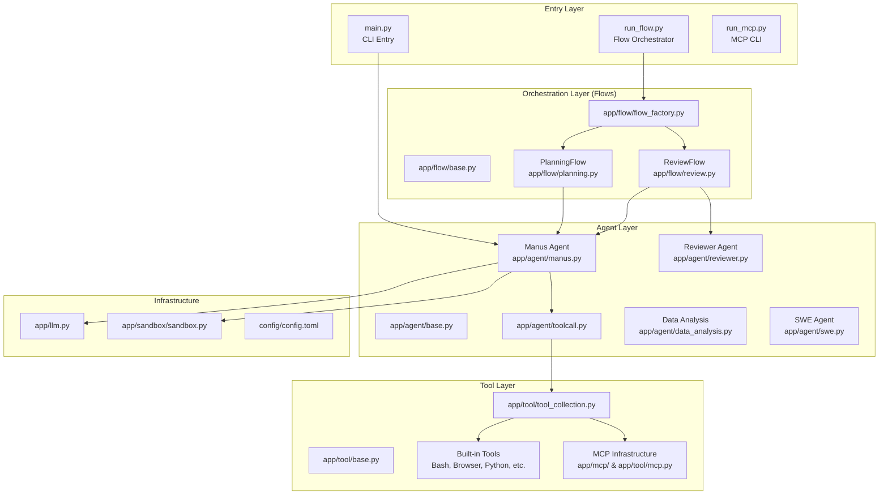

# OpenManus Repository & Architecture Map

This document provides a comprehensive technical overview of the OpenManus system, mapping its modular architecture to the physical file structure.

---

## 🏗️ System Overview

OpenManus is built on a **Modular Orchestration** pattern. It separates reasoning (Agents), coordination (Flows), and action (Tools).

---

## 🤖 Agent Profiles

All agents inherit from [BaseAgent](file:///c:/Users/jacob/OneDrive/Desktop/OpenManus_Antigravity/openmanus/app/agent/base.py).

| Agent | File | Purpose |
| :--- | :--- | :--- |
| **Manus** | [manus.py](file:///c:/Users/jacob/OneDrive/Desktop/OpenManus_Antigravity/openmanus/app/agent/manus.py) | **Primary Doer**. General-purpose executor with full tool access (Browser, Python, MCP). |
| **Reviewer** | [reviewer.py](file:///c:/Users/jacob/OneDrive/Desktop/OpenManus_Antigravity/openmanus/app/agent/reviewer.py) | **Critic/Auditor**. Grades outputs PASS/FAIL and provides actionable feedback for self-correction. |
| **DataAnalysis** | [data_analysis.py](file:///c:/Users/jacob/OneDrive/Desktop/OpenManus_Antigravity/openmanus/app/agent/data_analysis.py) | **Specialist**. Tailored for data processing, CSV/Excel manipulation, and visualization. |
| **SWE** | [swe.py](file:///c:/Users/jacob/OneDrive/Desktop/OpenManus_Antigravity/openmanus/app/agent/swe.py) | **Specialist**. Focused on software engineering tasks and codebase manipulation. |
| **ToolCallAgent** | [toolcall.py](file:///c:/Users/jacob/OneDrive/Desktop/OpenManus_Antigravity/openmanus/app/agent/toolcall.py) | **Logic Base**. Handles the mechanics of deciding which tool to call and processing results. |

---

## 🌊 Workflows (Flows)

Flows handle the interaction logic between agents and state management.

- **[PlanningFlow](file:///c:/Users/jacob/OneDrive/Desktop/OpenManus_Antigravity/openmanus/app/flow/planning.py)**:
  - Creates a multi-step plan tailored to the user's prompt.
  - Executes steps iteratively, checking for blockers or completion at each stage.
- **[ReviewFlow](file:///c:/Users/jacob/OneDrive/Desktop/OpenManus_Antigravity/openmanus/app/flow/review.py)**:
  - Implements a **Doer-Critic loop**.
  - Retries tasks if the Reviewer finds flaws, up to a configurable limit.
- **[FlowFactory](file:///c:/Users/jacob/OneDrive/Desktop/OpenManus_Antigravity/openmanus/app/flow/flow_factory.py)**:
  - Central dispatcher for instantiating flows based on configuration.

---

## 🛠️ Tool System

### Built-in capabilities ([app/tool/](file:///c:/Users/jacob/OneDrive/Desktop/OpenManus_Antigravity/openmanus/app/tool))

- **BrowserUseTool**: Full Selenium/Playwright-style web automation.
- **PythonExecute**: Execution of Python code in a safe local or Daytona sandbox.
- **StrReplaceEditor**: Precision line-based text editing.
- **Bash**: Direct shell command execution.
- **WebSearch**: Multi-engine search interface (Google, DuckDuckGo, etc.).
- **AskHuman**: Interaction loop to request missing data or decisions from the user.

### MCP (Model Context Protocol)

- **Filesystem Server**: Secure file operations with directory-level access control.
- **Registry**: Discovered via [app/mcp/](file:///c:/Users/jacob/OneDrive/Desktop/OpenManus_Antigravity/openmanus/app/mcp). Tools are dynamically injected into Manus at runtime.

---

## ⚙️ Configuration & Infrastructure

- **[config.toml](file:///c:/Users/jacob/OneDrive/Desktop/OpenManus_Antigravity/openmanus/config/config.toml)**: Central settings for LLM models (OpenRouter), MCP paths, and Agent toggles.
- **[app/config.py](file:///c:/Users/jacob/OneDrive/Desktop/OpenManus_Antigravity/openmanus/app/config.py)**: Pydantic-based configuration loader.
- **[app/llm.py](file:///c:/Users/jacob/OneDrive/Desktop/OpenManus_Antigravity/openmanus/app/llm.py)**: Unified interface for GPT-4o, Claude, and OpenRouter models. Includes token counting and cost tracking.
- **[app/sandbox/](file:///c:/Users/jacob/OneDrive/Desktop/OpenManus_Antigravity/openmanus/app/sandbox)**: Daytona-based code execution environments.

---

> [!TIP]
> **Information Integrity**: The system prompt in [manus.py](file:///c:/Users/jacob/OneDrive/Desktop/OpenManus_Antigravity/openmanus/app/prompt/manus.py) is optimized to distinguish between real-time web retrieved data and internal training data to minimize hallucinations.
